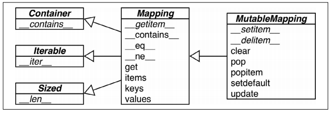

### 3.1 泛映射类型

`collections.abc`模块中有`Mapping`和`MutableMapping`两个抽象类,他们可以为dict和其他类似的类型定义形式接口.



标准库里面的所有映射类型都是利用`dict`来实现的,因此他们有个共同的限制,只有`可散列`的数据类型词啊能用做这些映射的键.

<kbd>Note:</kbd>

> 如果一个对象是可散列的,那么在逐个对象的生命周期中,他的散列值是不变的,而且逐个对象需要实现`__hash__()`方法.另外开三列对象还要有`__eq__()`用作与其他键做比较.

**并非所有的不可变类型都是散列值,例如元组,虽然本身不可变,但是其内部的元素是可变的.**

```python
tf = (1,20, [30, 40])
hash(tf)
>>>TypeError: unhashable type: 'list'
```

---

### 3.2 字典推导式

跟列表推导式类似,只是将`[]`替换成了`{}`

```python
dict_cells = [(86, 'China'), (91, 'India'), (1, 'United State'),
              (81, 'Japan'), (7, 'Russia')]
country_num = {con: code for code, con in dict_cells}
print(country_num)
>>>{'China': 86, 'India': 91, 'United State': 1, 'Japan': 81, 'Russia': 7}
```

---

### 3.3 常见映射方法

|                            | dict | defaultdict | orderedDict |                                                              |
| -------------------------- | ---- | ----------- | ----------- | ------------------------------------------------------------ |
| d.clear()                  | *    | *           | *           | 移除所有元素                                                 |
| d.\__contians__(k)         | *    | *           | *           | 是否存在k                                                    |
| d.copy()                   | *    | *           | *           | 浅复制                                                       |
| d.\__copy__()              |      | *           |             | 用于支持copy.copy                                            |
| d.default_factory()        |      | *           |             | 在\__miss__()函数中调用,用以给未找到的元素设置值             |
| d.\__delitem__(k)          | *    | *           | *           | del d[k],移除键值为k的元素                                   |
| d.fromkeys(it, [initial])  | *    | *           | *           | 将迭代器it里的元素设置为键,如果有initial参数,就把它作为这些键的对应值,默认炜None. |
| d.get(k, [default])        | *    | *           | *           | 返回键k的值,如果字典没有键k,则返回 None或者default.          |
| d.\__getitem__(k)          | *    | *           | *           | 让字典能够采用d[k]的形式返回键值                             |
| d.items()                  | *    | *           | *           | 返回字典中那所有的键                                         |
| d.\__iter__()              | *    | *           | *           | 获取键的迭代器                                               |
| d.keys()                   | *    | *           | *           | 获取所有的键                                                 |
| d.\__len__()               | *    | *           | *           | 可以使用len(d)的形式得到字典里键值对的数量                   |
| d.\__missing__(k)          |      | *           |             | 当\__getitem__()找不到对应的键的时候,这个方法会被调用        |
| d.move_to_end(k,[last])    |      |             | *           | 把键k的元素移动到最考前或者最靠后的位置(last的默认值是true)  |
| dd.pop(k, [default])       | *    | *           | *           | 返回键k所对应的值,然后移除这个键值对,如果不存在该键值对,则返回None或者default |
| d.popitem()                | *    | *           | *           | 随机返回一个键值并从字典里移除                               |
| d.\__reversed__()          |      |             | *           | 返回倒序键的迭代器                                           |
| d.setdefault(k, [default]) | *    | *           | *           | 若字典有键k,则把它对应的值设置为default,然后返回这个值,若无,则让d[k]=default,然后返回default. |
| d.\__setitem__(k, v)       | *    | *           | *           | 实现d[k]=v操作,把k对应的值设为v                              |
| d.update(m, [**kargs])     | *    | *           | *           | m可以是映射或者键值对迭代器,用来更新d里对应的条目            |
| d.values()                 | *    | *           | *           | 返回字典里的所有值                                           |


​	